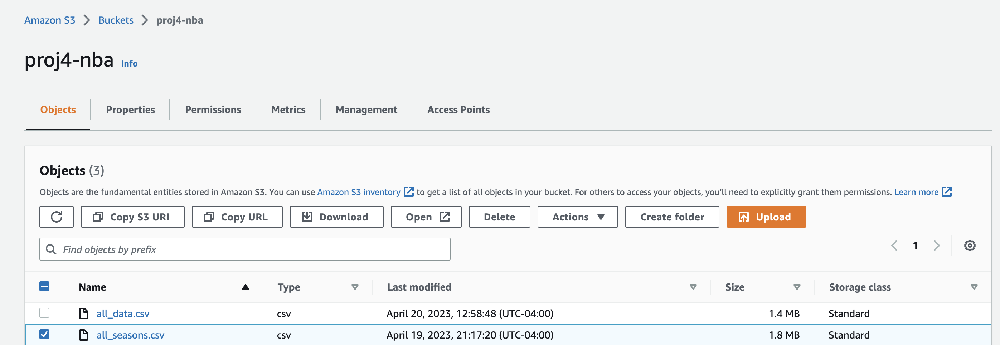
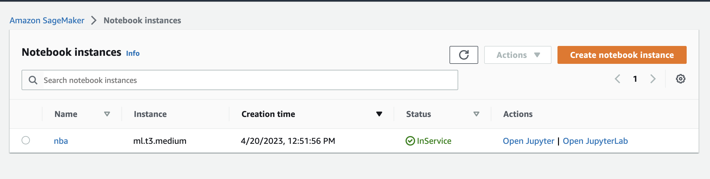
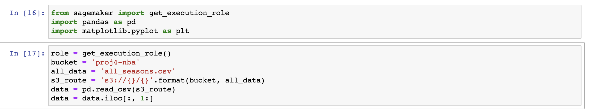
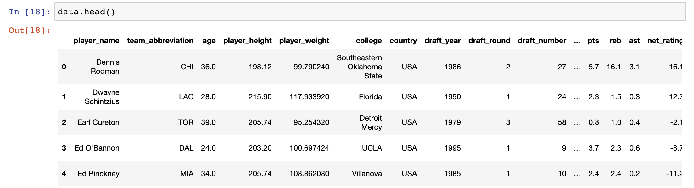
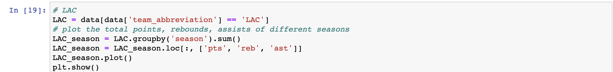
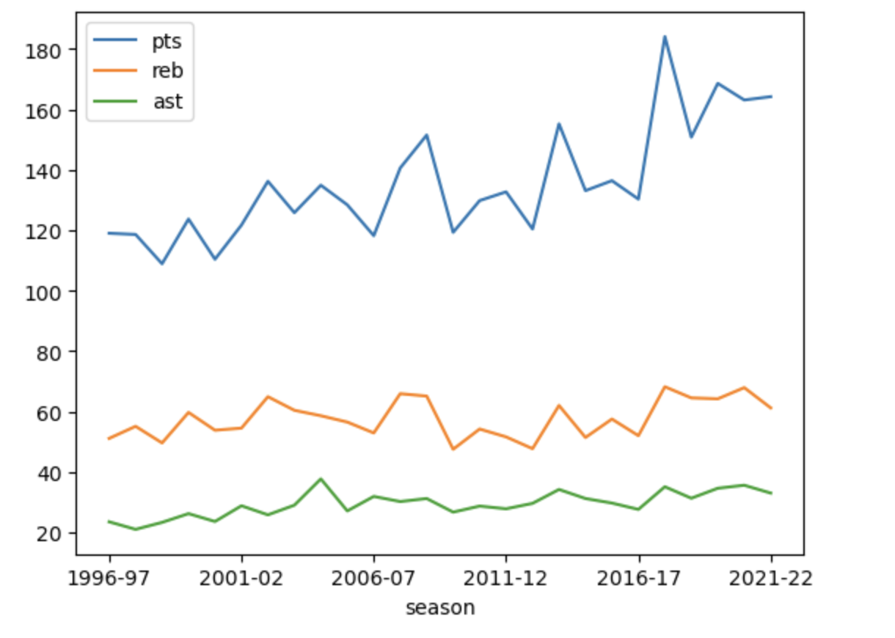
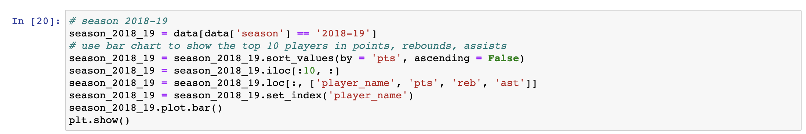
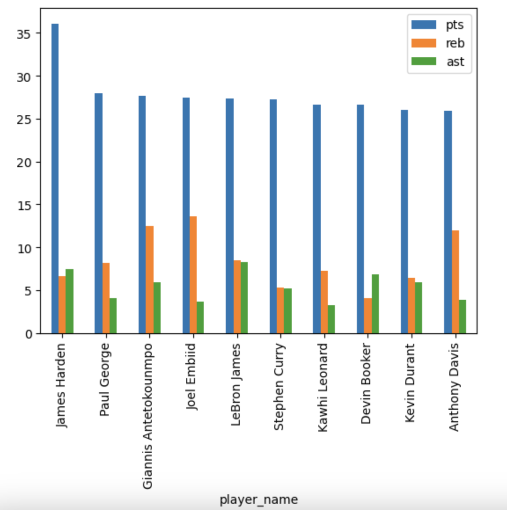
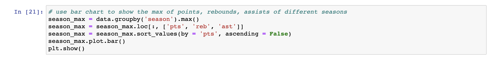
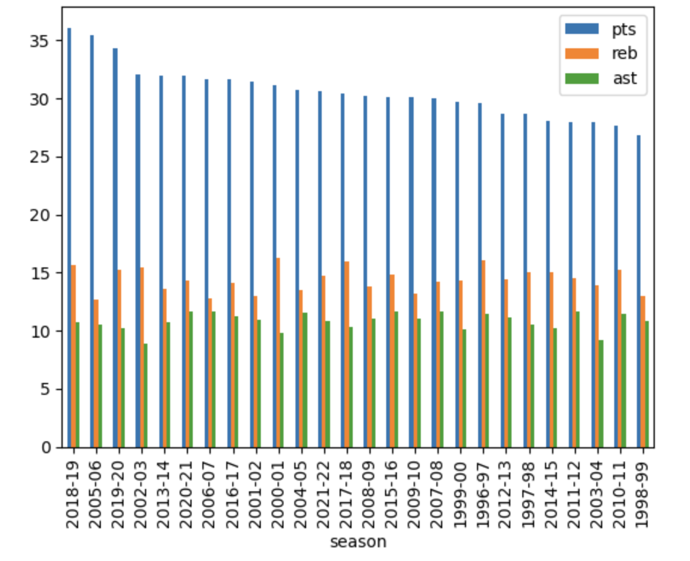

# Project4

## Description

This is a project aming to build a CLI tool for data engineering with AWS Athena. The dataset is information of NBA players from 1996 to 2021 season.

## Steps

1. Clean the data and upload it to AWS S3.
2. Use AWS SageMaker to process the data.

## Columns of the dataset

player_name	team_abbreviation	age	player_height	player_weight	college	country	draft_year	draft_round	draft_number	gp	pts	reb	ast	net_rating	oreb_pct	dreb_pct	usg_pct	ts_pct	ast_pct	season

- player_name: Name of the player
- team_abbreviation: Abbreviated name of the team the player played for (at the end of the season)
- age: Age of the player
- player_height: Height of the player (in centimeters)
- player_weight: Weight of the player (in kilograms)
- college: Name of the college the player attended
- country: Name of the country the player was born in (not necessarily the nationality)
- draft_year: The year the player was drafted
- draft_round: The round the player was drafted
- draft_number: The number at which the player was picked in his draft round
- gp: Games played throughout the season
- pts: Average number of points scored
- reb: Average number of rebounds grabbed
- ast: Average number of assists distributed
- net_rating: Team's point differential per 100 possessions while the player is on the court
- oreb_pct: Percentage of available offensive rebounds the player grabbed while he was on the floor
- dreb_pct: Percentage of available defensive rebounds the player grabbed while he was on the floor
- usg_pct: Percentage of team plays used by the player while he was on the floor
- ts_pct: Measure of the player's shooting efficiency that takes into account free throws, 2 and 3 point shots
- ast_pct: Percentage of teammate field goals the player assisted while he was on the floor
- season: NBA season

## Example

1. Clean the data and upload it to AWS S3

2. Use AWS SageMaker to process the data

3. In the notebook, import necessary libraries and data

The data looks like this:

If we want to get LAC's data of points, rebounds and assists during different seasons:

If we want to get data of season 2018-19

If we want to get max of points, rebounds and assists of each seasons

## References

* [rust-cli-template](https://github.com/kbknapp/rust-cli-template)
* [Dataset of NBA players](https://www.kaggle.com/datasets/justinas/nba-players-data)
